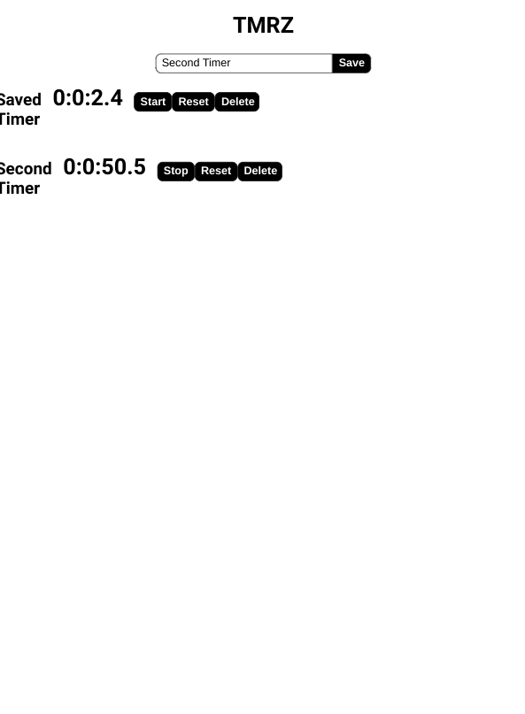

<h1 align="center">React Redux Timers App Tutorial</h1>

   Tutorial from  <a href="https://makeschool.org/mediabook/oa/tutorials/react-redux-passwords-app-tutorial-oh4/react-redux-timers-introduction/" target="_blank">makeschool.org</a>.

## Table of Contents

- [Overview](#overview)
  - [Built With](#built-with)
- [Features](#features)
- [Improvements](#improvements)
- [Useful Resources](#useful-resources)

## Overview

MakeSchool was a coding bootcamp that went under.  Most content was made free and I found this and decided to follow along.

[Live Link](https://jdegand.github.io/tmrz-app)

### Built With

- React
- Redux
- Lodash

## Features

Create and save multiple timers with reset and delete functionality.  

## Improvements

- Styling
- Performance
- Accessibility
- Need to reset input value after saving timer

### Useful Resources 

- [React](https://reactjs.org/docs/hooks-intro.html) - Hooks
- [React Redux](https://react-redux.js.org/) - React Redux
- [Stack Overflow](https://stackoverflow.com/questions/57519905/how-delete-item-from-redux-state) - Delete Item from Redux state
